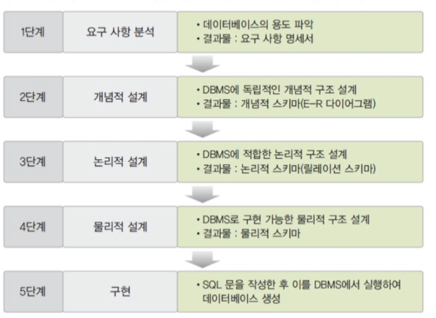
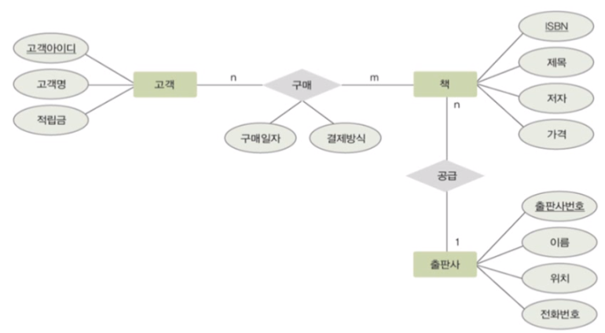
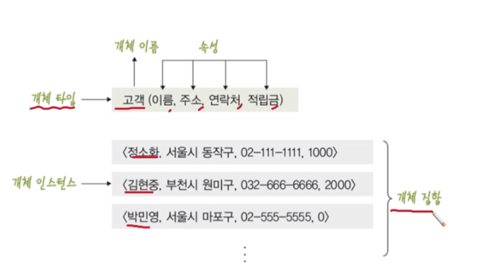

# 데이터베이스 시스템 ⅳ

## 데이터베이스 설계(1-3단계)

## 데이터모델링 과 모델

- 모델링 

  - 현실세계 데이터를 가상 세계 데이터로 만드는 작업

  - 개념적 데이터 모델링(추상화) : 현실 세계의 특성을 분석하여 개념화하는 작업/ 2단계

  - 논리적 설계 : 개념 세계를 데이터베이스 구조에 맞게 저장하는 작업 / 3단계

    

- 데이터 모델

  - 모델링의 결과물

  - 개념적 데이터 모델

    - 현실세계를 데이터베이스의 개념적 구조로 표현
    - 개체-관계 모델(Entity-Relationshipmodel)

  - 논리적 데이터 모델

    - 개념적 구조를 논리적 모델링하여 데이터베이스로 표현

    - 관계 데이터 모델(E-R diagram)

      

      

##  개체-관계 모델(Entity-Relationshipmodel)

  - 개체- 관계 모델

      - 개체 간 관계를 이용해 현시 세계를 개념적 구조로 표현

      - 핵심 요소 : 개체, 속성, 관계

        

  - 개체- 관계 다이어그램

    - E-R 다이어그램

    - 개체- 관계 모델링을 그림으로 표현

      

      - 개체 (네모) :고객, 책,  출판사

      - 관계 (마름모) : 구매, 공급

      - 속성(타원) : 출판사번호(key: 밑줄로 구분), 고객명 등...

## 개체 관계 모델 용어

  - 개체

      - 사각형으로 표시

      - 현실에서 사람, 사물처럼 구별되는 모든 것

      - 저장 가치와 이름 고유 특성(속성)이 필요하다

          - 서점 개체: 고객, 책
          - 학교 개체: 학과, 과목
          - 병원 개체: 의사, 병실

        

- 속성

  - 타원으로 표시
- 의미 있는 데이터의 가장 작은 논린적 단위
  
  - 개체나 관계가 가진 고유 특성

- 개체 타입

  - 개체를 고유 이름과 속성으로 정의

  - 파일 구조의 레코드 타입에 대응

    

- 개체 인스턴스

  - 개체 속성이 실제 값을 가져서 실체화

  - 개체 어커런스라고도 함

  - 파일 구조 레코드 인스턴스에 대응

    

- 개체 집합

  - 특정 개체 타입에 대한 개체 인스턴스를 모아놈

​    

- 관계 

  - 개체사이의 대응관계 매핑을 의미

  - 마름모로 표현

  - 이항/ 삼항/ 순환(자기 자신과) 관계로 나눈다.

    

  - 관계 유형  

    - 매핑 카디널리티(각 개체가 연관성을 맺는 상대 개체 집합의 인스턴스 개수)를 기준으로 결정

    - 1:1

    - 1:n

    - m:n

      

## 속성

- 단일 속성: 이름

- 다중 속성: 연락처

  - 일반 타원이 아닌 이중 타원으로 표시!

    

- 단순 속성: 분해 불가, id

- 복합 속성: 생년월일 => 년 /월/ 일

  - 속성 밑에 속성이 추가로 존재

    

- 유도 속성:  하나의 속성으로 부터 유도 되는 속성 

  - 값이 따로 저장되지 않음

  - 주민번호 => 나이, 가격, 할인율로 부터 실판매가 유도

  - 점섬 타원으로 표시

    

- 널 속성:

  - 아직 모르거나 존재하지 않는 값이 허용되는 속성

    

- 키 속성:

  - 인스턴스 객체를 구별 할 수 있다.
  
  - 둘 이상의 속성을 이용하여 사용하기도 함(이름 + 생일)
  
    

​									개체, 관계, 속성, 키속성, 다중속성, 복합속성, 유도 속성, 절대적 참여, 1:n 관계

 ## 관계

- 1:1 관계

  - 하나 당 하나랑만 관계를 맺을 수 있음

  - 부부

    

- 1: n 관계

  - 하나가 여려개와 관계를 맺을 수 있음

  - 부서와 사원

    

- m:n 관계

  - 여러개와 여러개가 관계를 맺을 수 있음

  - 고객과 책
  
    

- 참여
  - 필수적 참여(모든 개체 인스턴스가 참여하여야함, 모든 회사원은 어떤 부서에 포함)
  - 선택 적 참여(일부만 참여해도 괜찮, 책을 구매 안 한 고객이 있어도 됌)

- 종속성

  - 약한 개체: 오너가 필요한 개체

  - 오너 개체: 다른 개체의 존재 여부를 결정하는 개체

  - 일반적으로 오너와 약한 개체는 일대다 관계를 가지고, 약한 개체는 필수참여하는 특징이 있다

  - 약한 개체는 오너개체의 키를 포함하여 키를 구성하는 특징이 있다

  - 관계 = 이중 마름모, 약한 개체 = 이중 사각형으로 표현

    

​    

