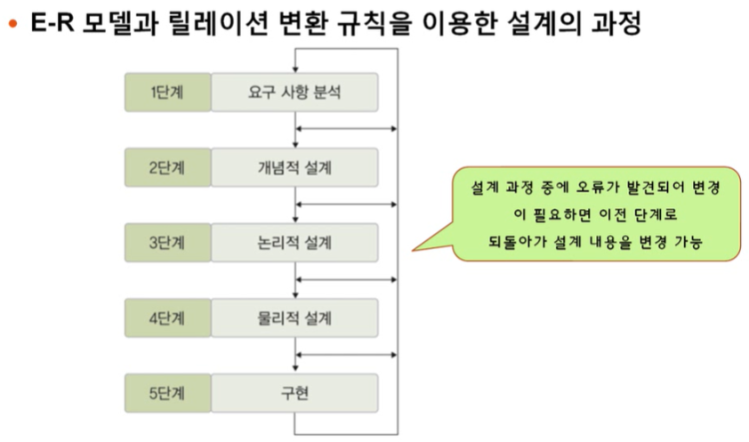

# chapter6. 관계 데이터 모델링

- 관계 데이터 모델의 기본 용어를익힌다
- 릴레이션을 구성하는 요소와 특성을 이해한다.
- 릴레이션에서 키의 역활과 종류를 알아본다.
- 무결성 제약의 의미와 필요성을 이해한다.

## 1. 이전 학습내용

- 데이터베이스 설계 과정

## 2. 관계 데이터 모델의 기본 개념

1. 관계 데이터 모델의 기본 개념

   - 개념적 구조를 논리적 구조로 표현하는 논리적 데이터 모델
- 하나의 개체에 대한 데이터를 하나의 릴레이션에 저장
   
2. 관계 데이터 모델의 기본 용어
   - 릴레이션 : 하나의 개체에 관한 데이터를 2차원 테이블 구조로 저장(파일시스템의 파일에 대응)
   - 속성 : 릴레이션의 열, (파일시스템의 필드)
3. 튜플
   - 릴레이션의 행 = 실제 값 ( 파일시스템의 레코드)
4. 도메인
   - 하나의 속성이 가질 수 있는 모든 값의 집합(적합성 판단의 기준)
5. 널
   - 속성 값을 아직 모르거나 해당 값이 없음을 표현
6. 치수
   - 하나의 릴레이션에서 속성 전체의 개수
7. 카디널리티
   - 하나의 릴레이션에서 튜플 전체 개수

## 3. 릴레이션의 구성

1. 릴레이션 스키마
   - 릴레이션의 논리적 구조
   - 정적인 특징
2. 릴레이션 인스턴스(릴레이션 외연)
   - 어느 시점의 릴레이션에 존재하는 튜플들의 집합
   - 동적인 특징
3. 릴레이션의 특성

## 4. 데이터베이스의 구성

1. 데이터베이스 스키마
   - 데이터베이스의 전체 구조
   - 데이터베이스를 구성하는 릴레이션 스키마의 모음
2. 데이터베이스 인스턴스
   - 데이터베이스를 구성하는 릴레이션 인스턴스의 모음

