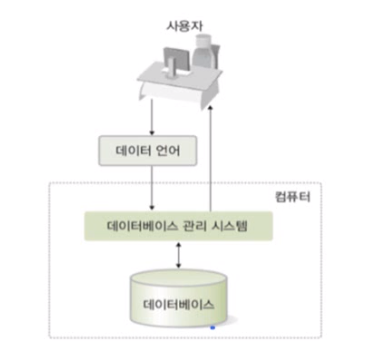
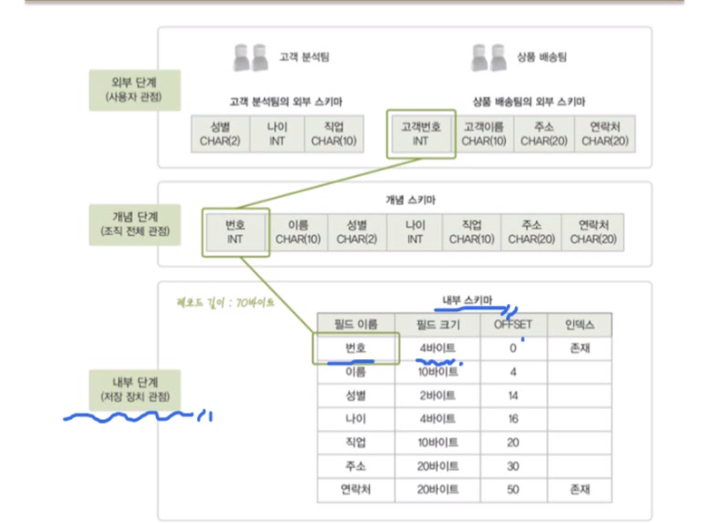
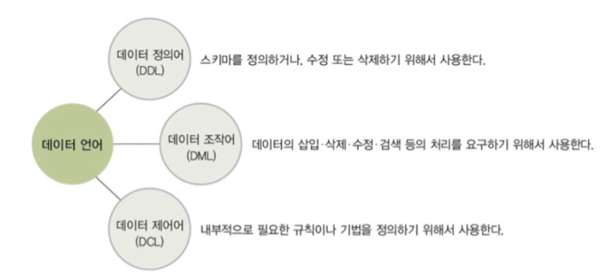
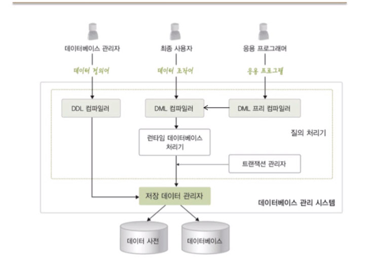

# 데이터베이스 시스템 Ⅲ

## 데이터베이스 시스템(dbs)

- `데이터베이스(db)`는 특정 조직 여러 사용자가 공유하여 사용할 수 있도록 통합해서 저장한 운영 데이터의 집합

- `데이터베이스 시스템(dbs)`는 데이터베이스에 데이터를 저장하고, 이를 관리하여 조직에 필요한 정보를 생성해주는 시스템

- `사용자`는 `데이터 언어`를 이용하여 `데이터 베이스 관리시스템`에 접근하고, 관리시스템을 이용하여 `데이터베이스`를 조작한다.

  

## 데이터베이스의 기본 구조

- 스키마 :  데이터베이스에 저장되는 데이터 구조와 제약조건을 정의한 것

  - ex) 이름 ==> CHAR(자료형태), 10(최대길이)가 스키마가 된다. 

    

- 인스턴스 : 스키마에 따라 데이터 베이스에 실제 저장된 값

  - ex) 이름: 홍길동

    

##  3단계 데이터베이스 구조(ANSI/SPARC)

  - 외부 단계 : 개별 사용자 관점

    - `외부 스키마`는 여러 개가 존재할 수 있다!

    - 왜냐하면, 사용자마다 데이터베이스의 모습이 다르기 때문에 사용자마다 다르다.

    - `서브 스키마`라고도 한다.

      

  - 개념 단계 : 조직 전체의 관점

    - `개념 스키마`는 조직당 오직 하나!

    - 조직 관체의 관점에서 바라봐서, 데이터의 저장방식, 데이터간 관계, 접근권한, 보안 등도 포함한다.

      

  - 내부 단계 : 물리적인 저장 장치의 관점 

    - `내부 스키마`도 오직 하나!

    - 저장데이터에 실제 저장되는 방식이므로 레코드 구조, 필드 크기, 접근 경로등 물리적 구조에 대한 이야기가 포함되어 있다

      

  - 내부-> 외부 로 갈수록 추상화 개념이 증가

  

  

  - ex) 아파트

    - 집주인(외부단계) : 2001호의 집 정보가 궁금함

    - 관리인(개념단계): 101동~105동 1호~2000호의 모든 집 정보가 궁금함

    - 건설업체(내부단계): 이 아파트의 내부와 뼈대를 어떻게 만들지(저장과 운영을 어떻게 할지) 가 궁금함

      

## 3단계 데이터베이스 구조의 사상 또는 매핑

- 응용 인터페이스 : 외부 스키마 와 개념 스키마의 대응 관계
- 저장 인터페이스 : 개념 스키마와 내부 스키마의 대응 관계
- 3단계 구조로 나누고 단계별 스키마를 유지하고 대응시키므로써 `데이터 독립성`을 실현한다
  - 데이터 독립성 : 하위 스키마를 변경하더라도 상위 스키마가 변하지 않는 특성
  - 논리적 독립성 : 개념스키마가 변경되어도 외부 스키마는 영향이 없다. 관련 사상만 정확히 수정
  - 물리적 독립성 : 내부 스키마가 변경되어도 개념 스키는 영향이 없다 관련 사상만 정확히 수정  

## 데이터베이스 구조 용어

- 데이터 사전
  - 데이터 카탈로그라고도 함
  - 스키마, 사상 정보, 다양한 제약조건을 저장한 사전
  - 데이터 베이스 관리 시스템이 알아서 생성하고 유지
  - 일반 사용자는 검색만 가능 조작 불가

- 데이터 디렉토리
  - 데이터 사전에 실제로 접근하는 데 필요한 위치 정보를 저장하는 시스템 데이터베이스
  - 일반 사용자는 접근 불가

- 사용자 데이터베이스
  - 사용자가 실제로 이용하는 데이터가 저장된 일반 데이터베이스

 ## 데이터베이스 사용자

- 데이터베이스를 접근하는 모든 사람을 지칭

- 이용목적에 따라 구분

  

- 데이터베이스 관리자
  - 데이터 정의어, 데이터 제어어를 사용
  - 구성 요소/ 스키마/ 접근 방법/ 제약/ 보안 방법을 정의 또는 결정
  - 백업과 관리 성능을 분석도 함

- 최종 사용자(end user)
  - 데이터베이스에 접근하여 데이터를 조작하는 사람 ex) 총무
  - 데이터 조작어를 사용

- 응용 프로그래머
  - 데이터 언어를 삽입하여 응용프로그램을 작성
  - 주로 데이터 조작어 사용

## 데이터 언어

- 사용자와 데이터베이스 관리 시스템 간의 통신 수단

- 사용목적에 따라 구분

  

- 데이터 정의어

  - 스키마를 정의/수정/삭제

- 데이터 조작어

  - 데이터를 삽입/삭제/수정/검색 

    

  - 절차적 데이터 조작어

    - 사용자가 어떤(what) 데이터를 원하고 그 데이터를 얻기 위해 어떻게(how) 처리할 지 설명

    - ex : 관계데이터연산 

      

  - 비절차적 데이터 조작어

    - 사용자가 어떤 데이터를 원하는 지만 설명

    - 선언적 언어(declararative lauguage)라고도 함

    - ex : sql

      

  - 데이터 제어어

    - 내부적으로 필요한 규칙이나 기법을 정의
    - 무결성/보안/ 회복/ 동시성을 위해서 사용

## 데이터베이스 관리 시스템

- 질의 처리기

  - 사용자의 데이터 처리 요구를 해석하여 처리

  - DDL, DML 컴파일러 DML 프리 컴파일러, , 트랜잭션 등을 포함

    

- 저장 데이터 관리자

  - 디스크에 저장도니 사용자 데이터베이스와 데이터 사전을 관리하고 접근하는 역활

