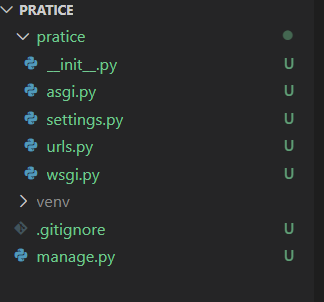
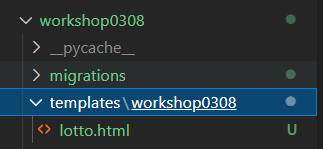

#### Date: 0309

#  Django Intro


## Django 프로젝트 만들기

1. 사용할 폴더 만들기
   - 가장 최상위폴더는 구분을 쉽게하기 위해 모두 대문자로 만드는 걸 권장.
   - 깃 등록 과정은 생략
   - 이 폴더 안에서 또는 클릭하여 vscode 실행
   - 이후 내용은 교수님의 start_django_process과 동일합니다.
2. `$ python -m venv venv` 명령어를 통해 가상독립환경 폴더를 만든다.
3. 가상독립환경을 활성화(`$ source venv/Scripts/activate`)한다.
4. `$ pip install django (+ a)` 를 통해 필요한 패키지들을 설치 한다.
5. `$ django-admin startproject <PROJECT NAME> .` 명령어를 통해 프로젝트 초기화


## 프로젝트 독립환경 설정

- 이 내용은 교수님의 start_django_process과 거의 동일합니다.
- 이 과정은 터미널을 완전히 종료후 다시 실행해야 될 때도 있습니다.

1. `ctrl` + `shift` + `p`
2. `>python: Select Interpreter` 입력
3. 자동으로 가상환경 폴더(`venv/`)안의 python을 잡지 못한다면
   1. `Enter interpreter path` => `find` => `venv/Scripts/python` 을 선택
4. 완료 이후 좌하단에 `Python 3.8.x 64-bit('venv')` 문구를 확인
5. 터미널 프롬프트에 `(venv)` 반드시 확인 후 진행




​											완료 후 폴더 상태(project root =PRATICE, masterapp = pratice)


##  Django 기초명령어, 기초 내용

- 앱 생성 명령어

  ```
  django-admin startapp pages
  ```

  - 앱 생성 후 반드시 masterapp(settings.py가 있는 폴더)의 `settings.py` 33행의 

     INSTALLED_APPS의 출생신고(등록)을 할 것

    - 장고는 html을 찾을때, 특정 앱 안에 templates안을 찾는다. 이 특정앱을 settings.py를 기준으로 찾기때문에, 등록하지 않으면 찾지 못한다
    - 단, 미리 출생신고(등록)를 하면 오류가 발생한다.


- 서버 실행 명령어

  ```
  python manage.py runserver
  ```

  - http://127.0.0.1:8000/ 기본 서버실행 시 이 주소로 들어가진다.

    127.0.0.1은 내 컴퓨터의 주소, 8000은 그 중 접속하는 디폴트 포트값이다.


- 필터 사용법

  ```
  {{ today|date:'Y년 m월 d일 (D) A H:i' }}는 날짜
  ```

  - 응답받은 today라는 key값에 value에 대해서 |하고 필터를 적용하여 표현방식을 수정할 수 있다. 


- framework와 라이브러리의 차이점
  - framework: 일의 순서도가 담긴 메뉴얼과 그 순서에 맞는 공구함을 제공한다.
  - library: 단순히 편리함을 위한 다양한 공구만 제공한다.
  - django 문법 != python 문법   => 전혀다름!!!! 


##  Django 요청과 응답

- 포워딩 (1)

  ```python
  from django.contrib import admin
  from django.urls import path, include
  
  urlpatterns = [
      path('admin/', admin.site.urls),
      path('workshop0308/', include('workshop0308.urls')),
      path('dinner/<menu>/<int:people>/', views.dinner ),
      path('', include('pages.urls')),
  ]
  ```

  - masterapp/urls.py에서 요청이 들어오면 해당 views.py 또는 해당 작업을 재생하도록 가리키는 작업

  - `path('workshop0308/', include('workshop0308.urls'))` 에서 'workshop0308/'란 요청이 오면,

    'workshop0308.urls'를 실행한다.

  - `path('dinner/<menu>/<int:people>/', views.dinner )`에서 `'dinner/<menu>/<int:people>/'`란 요청이 오면, 'views.dinner'을 실행한다.

  - `path('', include('pages.urls'))`에서 경로가 `''`가 오게된다면, 모든 요청을 'pages.urls'로 전송한다. 이 때문에, 사용순서에 크게 주의해야한다.

  - `urlpatterns = []`가 존재하지 않으면 오류가 발생한다.

  - `/` 가 앞에 붙으면 오류, 뒤에 없어도 오류가 발생하니 주의할 것.


- 포워딩 (2)

  ```python
  from django.shortcuts import render
  from django.http.response import HttpResponse
  import random
  
  # Create your views here.
  def lotto(request):
      lotto = random.sample(range(1,46), 6)
      data = {
          'lotto' : sorted(lotto),
          'greeting' : 'hellow world!'
      }
      return render(request, 'workshop0308/lotto.html', data)
  ```

  - 반드시 HttpResponse형태로 반환해야한다
  - 반드시 함수의 첫인자로 request를 받아야한다. 반환값도 마찬가지이다.
  - python 형식으로 기존과 같이 작업할 수 있지만, 넘기는 자료형은 반드시 딕셔너리 형태로 전달해야한다.
    - 이유는 html이 key와 value로 이루어진 세상이기 때문에, 
    - 딕셔너리를 받아서 리스트처럼 언팩킹하여 사용한다.
  - 이렇게 반환된 값을 html에서 설정된대로 보여준다.


- templates 등록하기

  ```python
  TEMPLATES = [
      {
          'BACKEND': 'django.template.backends.django.DjangoTemplates',
          'DIRS': [BASE_DIR / 'templates'],
          'APP_DIRS': True,
          'OPTIONS': {
              #생략
      },
  ]
  ```

  - templates는 app_dir/templates를 탐색하는 것이 디폴트로 정해져있다. 이곳 이외의 장소를 찾으려면 `settings.py`의 TEMPLATES 내부 'DIRS'에 찾는 위치를 추가해주어야한다.
  - BASE_DIR은 해당 폴더의 project root를 잡는 함수로 이를 이용하여 project root를 표시한다.


- name spacing (1)

  - 장고는 단순하게 파일을 모아서 이름을 확인하는데, 같은 이름이 있다면 이를 구별하지 못한다.
  - 따라서, 파일명을 따라한 폴더안에 넣어 경로를 추가하면 구별이 가능하다.

  ```
  p09 > temp > p09 > lotto.html
  app_name > template > app_name > html
  ```

  

  - 이런식으로 표현하면 workshop0308의 lotto.html임을 확실히 구별가능하다.
  
  

- 변수<> 사용법

  ```python
  urlpatterns = [
      path('var_route/<int:value>/', views.var_route),
  ]
  ```

  - 해당 urlpatters의 <>를 이용해 넣은 것은 변수로 전달이 된다.
  - 해당 변수는 기본적으로 string이나 앞에 `int:` 등을 붙여줌으로써 형변환이 가능하다.

  ```python
  def var_route(request, value):
  
      return HttpResponse(value)
  ```

  - 이 때, 해당 변수에 해당하는 views의 함수에 <>값을 전달인자로 반드시 추가해야한다.(없을 시 오류)

    

- form 사용법

  ```python
  <form action="" method = "GET">
      <label for="kor-name">한글이름</label>
      <input type="text" name = "kor-name" id ="kor-name">
      <label for="">영어이름</label>
      <input type="text" name = 'eng-name' id= 'eng-name'>
      <input type="submit" value = "전송!">
    </form>
  ```

  - label은 시멘틱 태그적 의미가 강해서 신경쓰지 않아도 된다.

  - action은 수신하는 url을 의미한다.

    - ``은 urls.py에서 지정된 별명을 받아서 수정이 따로 필요없어진다.

    - 굳이 별명을 사용하지 않고, 실제 경로(ex: /ping.html)로도 불러올 수 있다. 

      별명을 설정하는 코드방식은 아래와 같다.

    ```python
    urlpatterns = [
        path('ping/', views.ping, name='ping')
    ]
    ```

  - method는 정보전달방식으로 정보공개여부를 설정할 수 있다.(get: 공개, post:비공개)

  - form을 사용함으로써, 요청을 보낼때, 데이터를 같이 보낼 수 있게 된다.

    이 정보는 request.get 내부에서 시작부터 같이 전달된다.

  - name = 'key' 가 되고 input = 'value'가 되어 전송된다.
  
  

TIP: x 디버깅 X하나를 쳐서 오류를 일부러 내고, 요청정보가 제대로 가는지 확인할 수 있다.


- request.get 사용법

  ```python
  def pong(request):
      request.GET # <QueryDict: {'kor-name': ['한국어'], 'eng-name': ['영어']}>
      
      kr_name = request.GET[]'kor-name']  # <input name="kor-name">
      en_name = request.GET.get('eng-name')
      return render(request, 'practice0309/pong.html', context)
  ```

  - request.GET[ ] = 딕셔너리의 키가 없으면 오류 발생
  - request.GET.get()= 딕셔너리의 키가 없어도 논을 리턴
  - 상황에 맞게 사용


