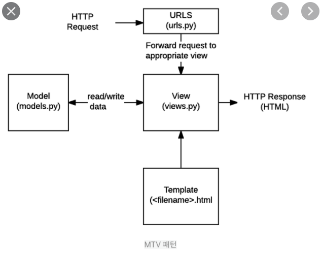

#### Date: 0308-morning

#  Django Intro

## what is Django?

python framework: 파이썬용 웹 개발 프레임워크

# why?  

- 본질적인 개발에 집중하기 위해서(수레바퀴를 만드는데 시간을 낭비하지 마라)

- 빠르고, 안전하고,  이미 로드되어있고, 다양하며, 거대하기 때문에 

# structure

- 소프트웨어 디자인 패턴: Model- View- Controller (MVC)
- Django 디자인 패턴 : Modle-Template-View(MTV)
- Model: 데이터 베이스관리
- Template : 레이아웃(화면)
- View: 중심 컨트롤러

# structure graphing

1). http : 서버가 요청을 받음

2). urls : 요청의 방향을 잡아줌

3). model : 데이터 베이스 관련 요청일 경우 view에 관련 정보를 넘겨줌

4).  template : view에 template을 넘겨줌

5). view : 받은 데이터와 template을 이용하여 html 등에 형식으로 응답해줌

#  DTL(django template language)

- django template built-in template system
- 조건, 반복, 변수 치환, 필터 등의 기능을 제공
- python 문법과 비슷할 뿐 html에 사용할 수 있는 전혀 다른 언어이다.
- 또한, python 프로그래밍 구조를 사용하지만 python 코드로 실행되는 것도 아니다

#  DTL Syntax

- variable
  - {{variable}}
  - views.py에서 정의한 변수를 render()를 사용하여 template 파일로 넘겨 사용
  - 변수명에 영어, 숫자, 밑줄(_)는 사용가능하지만, 밑줄로 시작은 불가
  - 공백, 구두점 문자 사용불가
  - dot(.)을 이용하여 변수 속성 접근 가능
  - 딕셔너리 형태로 넘겨주며, key값이 해당 문자열 template에서 사용가능한 변수명이 됌
-  Filters
  - {{variable|filter}}
  - ex) {{variable|lower}} : 모두 소문자로 출력하는 필터
  - 일부는 인자사용이 가능하다.
  - 약 60개
- Tags
  - 
  - 출력 텍스트, 반복, 논리 등 변수보다 복잡한 일을 수행할 때 사용
  - 일부 태그는 종료태그 필요  
  - 약 24개
- Comments
  - 한줄 주석: {# #}
  - 여러줄 주석:  