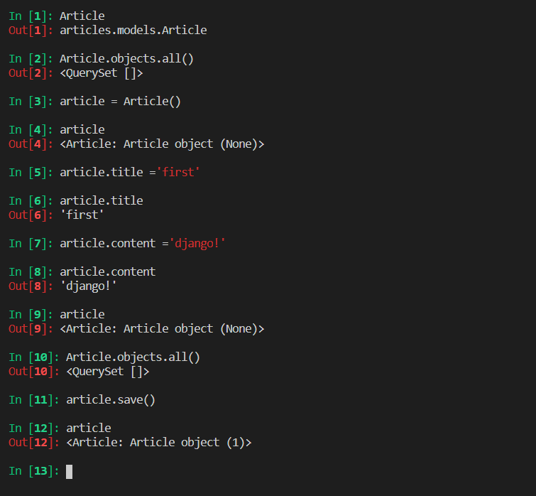
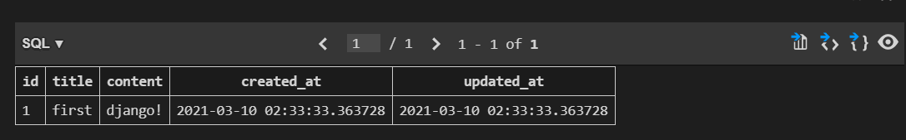
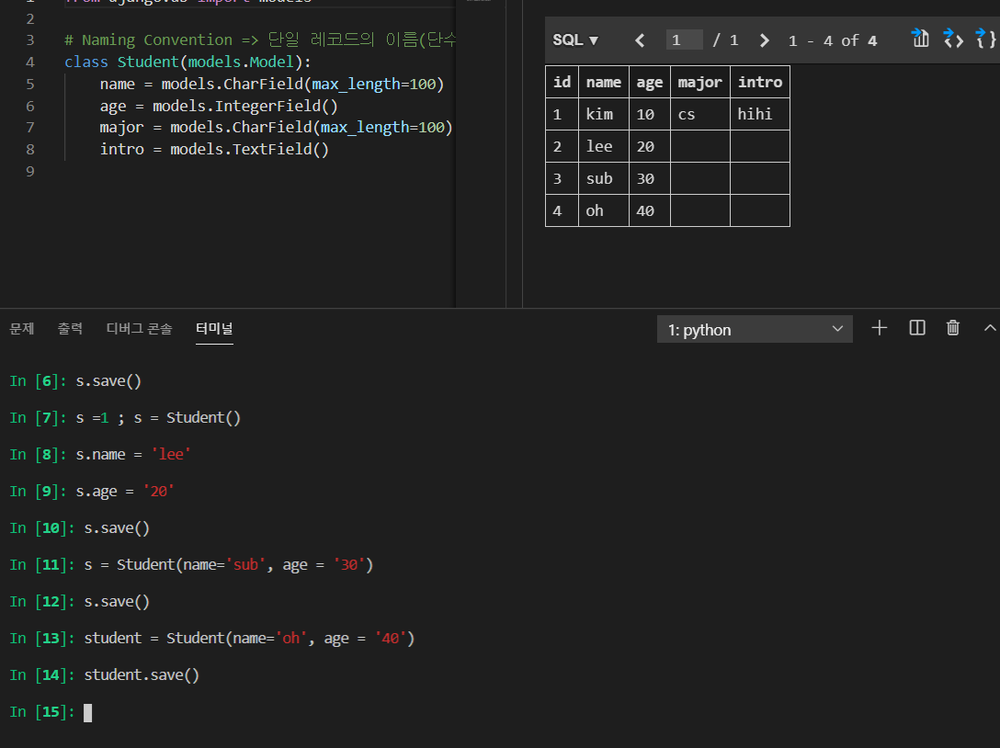

0311

## Configuration

방법1). article.< 변수1 > = < 변수2 >

방법2). article = Article(title='', content = '')

방법3). Student.objects.create(name='sik', age = '50')

몇몇 방법은 save()를 해야만, 데이테베이스의 적용된다.

.save()  -> instance_method

