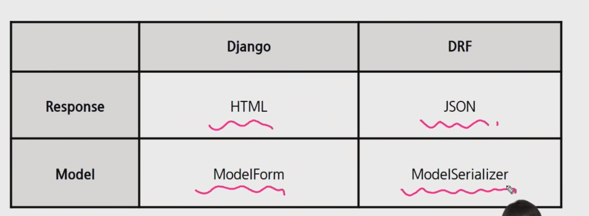

#  Django_Rest_Framework: Serializer 


## 1. Serializer(직렬화)

- 데이터 구조나 객체 상태를 동일하거나 다른 컴퓨터 환경에 저장하고 나중에 재구성 가능한 포맷으로 변환하는 과정
- 예를 들어, DRF의 Serializer는 장고의 쿼리셋 등 복잡한 데이터를 JSON으로 변경이 쉬운 파이선 데이터 타입으로 만들어준다.


​	요약: 쿼리셋(article) -> json 을 만들어주는 변환기 역활


## 2. DRF

- 웹 api와 rest framework 개발에 필요한 다양한 기능을 제공한다.
- `DRF`가 `Serializer`를 해야할 경우, `ModelSerializer`를 제공한다. (==ModelForm)
- 


## 3. ModelSerializer 작성

```python
# 1. serializer(형식)과 사용할 모델(article)을 불러온다.
from rest_framework import serializers
from .models import Article

# 2. form과 완전히 동일하다.
class ArticleSerializer(serializers.ModelSerializer):
    # 2-1. 검증하고자하는 자료 형식 작성
    title = serializers.CharField(min_length=2, max_length=100)
    content = serializers.CharField(min_length=2)
    
    # 2-2. 참고모델과 보여줄 양식(field) 선택, form처럼 exclude등 사용가능
    class Meta:
        model = Article
        fields = '__all__'
```


## 4. Serializer in views.py 

```python
@api_view(['GET', 'PUT', 'DELETE']) #3
def article_detail(request, pk):
    if request.method == 'GET':
        serializer = ArticleSerializer(article) #1
        return Response(serializer.data) #2
```

- 1장에서는 이를 상세히 다루지 않음, views에도 변경점만 가볍게 확인할 것.

- #1. 기존 form 역활을 serializer가 대신하고 있다.

- #2. 응답을 html이 아닌 json 형식을 보내는 걸로 뒤바뀜

- #3. api_view가 없으면 error가 나도록 되어있다.

  