#  Django_Rest_Framework: 문서작성 댓글작성전

- 깨끗한 코드는 항상 교수님 원본을 볼 것

- 숙련자 생략은 예전에 한 내용으로 생략해도 좋다.

- 추가내용: 생략가능은 혼자서 궁금한 거 적어논 거라 생략하셔도 좋습니다.

  

## 1. 장고의 시작 (숙련자 생략)

1. `$ python -m venv venv` 명령어를 통해 가상독립환경 폴더를 만든다.
2. 가상독립환경을 활성화(`$ source venv/Scripts/activate`)한다.
3. `$ pip install django djangorestframework django_extensions django_seed ` +a 를 통해 필요한 패키지들을 설치 한다.
4. `$ django-admin startproject <PROJECT NAME> .` 명령어를 통해 프로젝트 생성
5. `$ django-admin startapp <app name>`을 통해 필요한 앱 생성


## 2. settings.py (숙련자 생략)

```python
INSTALLED_APPS = [
    # local apps
    'app_name',

    # 3rd parth apps
    'django_extensions',
    'django_seed',
    'rest_framework',
```


## 3. urls.py (숙련자 생략)

- masterapp_urls.py

```python
from django.contrib import admin
from django.urls import path, include

urlpatterns = [
    path('admin/', admin.site.urls),
    path('api/', include('api.urls')),
]
```


- app.urls.py

```python
from django.urls import path
from . import views

app_name = 'api'

urlpatterns = [

]
```


## 4. models.py  (숙련자 생략)

```python
from django.db import models

class Article(models.Model):
    title = models.CharField(max_length=100)
    content = models.TextField()
    created_at = models.DateTimeField(auto_now_add=True)
    updated_at = models.DateTimeField(auto_now=True)
    

class Comment(models.Model):
    article = models.ForeignKey(Article, on_delete=models.CASCADE, related_name='comments')
    content = models.CharField(max_length=200)
```


## 5. serializers.py

```python
from rest_framework import serializers
from .models import Article

class ArticleSerializer(serializers.ModelSerializer):
    title = serializers.CharField(min_length=2, max_length=100)
    content = serializers.CharField(min_length=2)
    class Meta:
        model = Article
        fields = '__all__'
        
class ArticleListSerializer(serializers.ModelSerializer):
    class Meta:
        model = Article
        # fields = '__all__'
        fields = ('pk','title')
        read_only_fields = fields
```

- forms의 역활을 serializers가 대신한다. 
- 검증하고자 하는 내용을 따로 서술(title, content)하여 검증한다.
- form과 마찬가지로 model을 계승하여 사용한다.
- 추가적으로, json파일을 만들어주는 역활도 수행한다.
- ArticleSerializer vs ArticleListSerializer :
  - 둘의 기능을 완벽히 동일하다.
  - 다만, index_or_create와 detail_에서  표시하고자 하는 내용(field), 기능(read_only), 검증내용(title,content) 등이 다르기 때문에 두 가지 serializers로 다르게 표현한다.  


## 6. urls.py

```python
urlpatterns = [
    # GET/POST => /api/articles/
    path('articles/', views.article_list_or_create),
    
    # GET/PUT/DELETE => /api/articles/1/
    path('articles/<int:article_pk>/', views.article_detail_or_update_or_delete),

]
```

-  restful한 구조이기 때문에 기존과 달리 index와 create, detail, update,delete가 통합되었으며 각각은 #에 표시 된 것처럼 request.method에 의해서 달라지게 된다.
- 통합기준은 공통 URL(int:article_pk 등)를 사용하는 것을 기준으로 나누어진다.


## 7. view.py

### 7-0. import

```python
from django.shortcuts import get_object_or_404 #1부터 한줄당 #하나씩
from rest_framework import status
from rest_framework.response import Response  # 이전의 render
from rest_framework.decorators import api_view  # 이전의 require_http_methods
from .models import Article, Comment
from .serializers import ArticleSerializer, ArticleListSerializer, CommentSerializer
```

1. get_object_or_404를 불러온다. 이 함수를 통해서 모델에 특정 개체를 불러올 수 있다.

2. status 기능을 이용하면 응답에 대한 상태코드를 같이 실어 보낼 수 있습니다.

   https://www.django-rest-framework.org/api-guide/status-codes/

3. 기존의 return과 redirect를 대신하여 Response가 응답 기능을 대신합니다. 이 응답 방식을 통해서 렌더링 없는 데이터인 json으로 변환된 값을 전달이 가능합니다.

4. api_view는 데코레이터로써 받을 수 있는 요청의 형식을 정해줍니다. 해당 요청 이외에 값이 들어올 경우 "405 Method Not Allowed"로 응답합니다.

5. modles.py에서 해당 모델들을 불러옵니다.

6. serializers.py에서 해당 serializers를 불러옵니다. 이 시리얼라이저들은 폼과 유사하게 사용합니다. 즉, (1). 데이터의 유효성 검증 (2). json 생성 의 역활을 수행하는 시리얼들을 가져옵니다.


### 7-1 . article_list_or_create

```python
@api_view(['GET','POST'])  # 해당 함수는 get과 post만 받습니다.
def article_list_or_create(request):
    #1. get의 경우
    if request.method == 'GET': 
        articles = Article.objects.all() #1-1. 아티클들을 가져온 후 
        serializer = ArticleListSerializer(articles, many=True) #1-2 시리얼라이저를 통해 입력
        #print("serializer start") #cf-1
        #print(serializer)
        #print("serializer end")
        return Response(serializer.data) # 1-3 시리얼 라이저의 데이터를 반환
    
    #2. post의 경우
    elif request.method == 'POST':
        serializer = ArticleSerializer(data = request.data) #2-1. data를 응답으로 받는다
        if serializer.is_valid(raise_exception=True): #2-2 유효성검사를 실행후 실패시 에러발생
            article = serializer.save() #2-3 통과한 객체를 serializer에 저장한다.
            return Response(serializer.data, status = status.HTTP_201_CREATED) #2-4
```

- #1-2. serializer 

  - 폼처럼 serialize 변수를 선언하고 그 값에 artilclelistserializer를 통해서 json화 된 데이터를 저장한다.

  - ArticleListSerializer(articles, many=True)에서 첫 항은 받고자하는 객체 쿼리셋들을 받는다.

  - many= True 항은 단항이 아닌 여러항을 가진 쿼리셋을 받을 경우 반드시 써줘야한다.

    

- #cf-1 기타 보충내용(추가내용: 생략 가능)

  - serializer을 프린트해서 살펴보면 json으로 변한 쿼리셋의 내용과 모델이 보여주고자 하는 필드들이 보인다.(fields =("title") 등으로 표시한 것만 보인다)
  - 타입은 listserializer로 이때 json파일로 변환된 것으로 보인다.

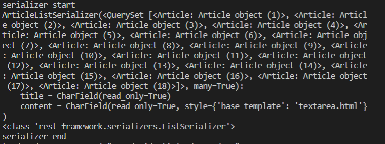


- #1-3. serializer.data(추가내용: 생략가능)

  - Responser를 통해 json으로 바로 전달한다.

  - serializer.data에 든 내용은 모든 객체와 그 객체가 가진 속성들 중 보여주고자 하는 속성들이다.

    - print한 결과

    ```
    [OrderedDict([('title', 'Street job guess Mr art from cost.'), ('content', 'Nice
     success finally you.\nFour war office stuff provide. Road walk lawyer. Off info
    rmation Congress gun certainly officer.')]), OrderedDict([('title', 'Gas who nic
    e your.'), ('content', 'Agreement those travel present reach consider for accord
    ing. Movie attack never head. Center involve finish choose.\nFinancial million f
    uture sport up response red.')]), #이하 생략
    ```

    - 실제 db
      - 위 내용이 이렇게 담겼다. created_at과 updated_at은 fields에 담겨있지 않아 표시되지 않는다.

    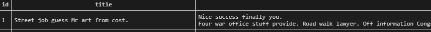

    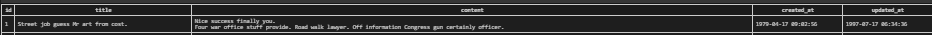


- #2-1.  serializer
  - 전의 경우에는 db의 객체들을 입력받았지만, 이번에는 응답으로부터 데이터(json)를 받아서 해당 폼에 입력한다.
  - 포스트맨을 통해서 보낸 데이터는 아래와 같다.
    - 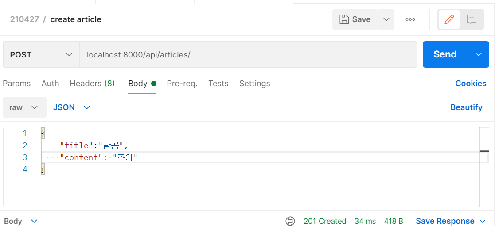


- #2-2. raise_exception=True
  - 유효성검사 불통과시 원래 다른 리턴 값(return Response(serializer.errors, status=400))을 따로 만들어줘야 했지만, raise_exception=True 코드를 작성함으로써 알아서 error가 발생한다.


- #2-4. status_code
  - 이 코드를 통해서 응답이 도달하면 201_created를 통해서 잘 생성이 되었음을 알 수 있다.


### 7-2. article_detail_or_update_or_delete

```python
@api_view(['GET', 'DELETE', 'PUT']) # 이번엔 get, delete, put 요청만 받는다
def article_detail_or_update_or_delete(request, article_pk):
     # 해당 객체들은 공통적으로 article 객체가 필요함으로 공통적으로 가져온다.
    article = get_object_or_404(Article, pk=article_pk)
    
    # 1. get
    if request.method == 'GET':
        # 1-1. 해당 정보를 직렬화 한뒤
        serializer = ArticleSerializer(article)
        # 1-2. 필요한 정보를 응답한다.
        return Response(serializer.data)
	
    # 2. put
    elif request.method == 'PUT':
        # 2-1. 수정내용을 데이터로 받는다, 인스턴스를 통해 기존 내용을 받는다.
        serializer = ArticleSerializer(data=request.data, instance=article)
        # 2-2. 유효성 검사를 통과하면 응답한다.
        if serializer.is_valid(raise_exception=True):
            serializer.save()
            return Response(serializer.data)
	
    #3. delete
    elif request.method == 'DELETE':
        #3-1. 해당객체를 삭제한다.
        article.delete()
        # 3-2. 삭제한 지 알 수 없으므로 커스텀메세지를 전달하여서 삭제사실 확인한다 (없어도 됌)
        data = {  # cutomize message
            'success': True,
            'message': f'{article_pk} 번 게시글이 삭제되었습니다.',
        }
        return Response(data=data, status=status.HTTP_204_NO_CONTENT)
```

- #1. 요청내용/ 응답내용 pk == 19

  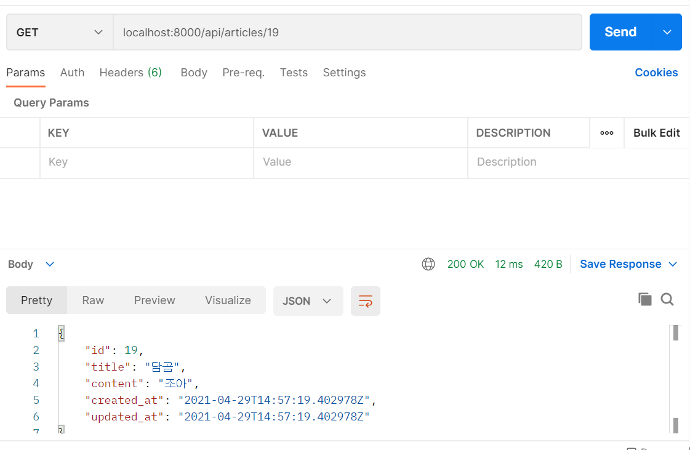


- #2

  - #2-1 instance = article이 없다면 해당 내용을 찾지못해 수정을 할 수 없게 되어버린다.

    - 아래 사진은 instance =article을 지우자 새로운 객체 20, 21을 생성한 사진이다.

    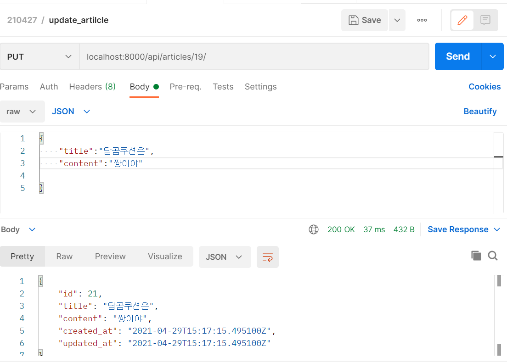

  - 요청내용/ 응답내용 pk == 19

  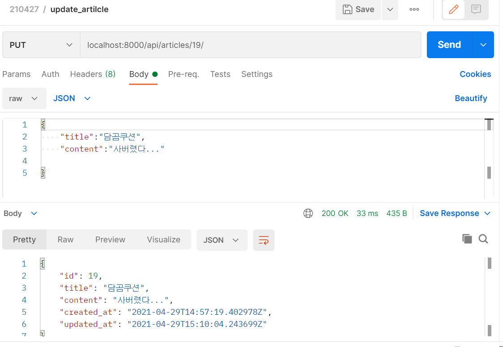


- #3 요청내용/ 응답내용 pk == 21

  - 정상 삭제시 아래와 같은 메시지가 출력된다.

  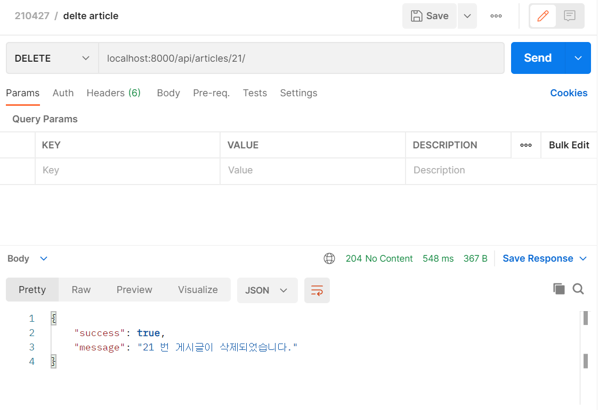

  - 리턴이 없다면???

    - 삭제는 되지만 갈 곳을 잃어서 에러가 나버린다.

    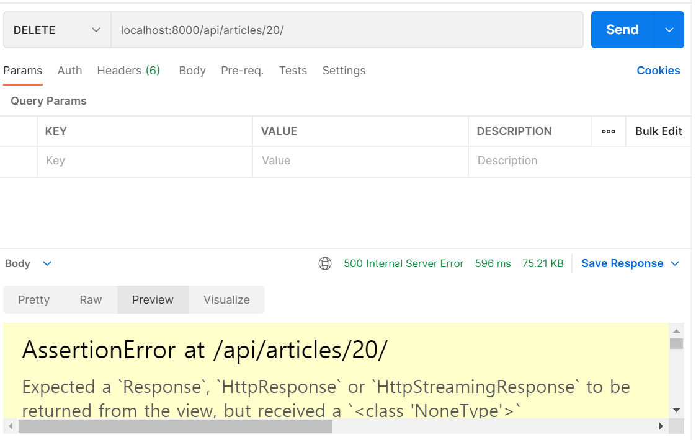

  - 리턴만 있다면?

    - 잘 삭제되지만 삭제했는지 확실히 알 수 없다

      ```python
      elif request.method == "DELETE":
              article.delete()
              return Response(status=status.HTTP_204_NO_CONTENT)
      ```

      

      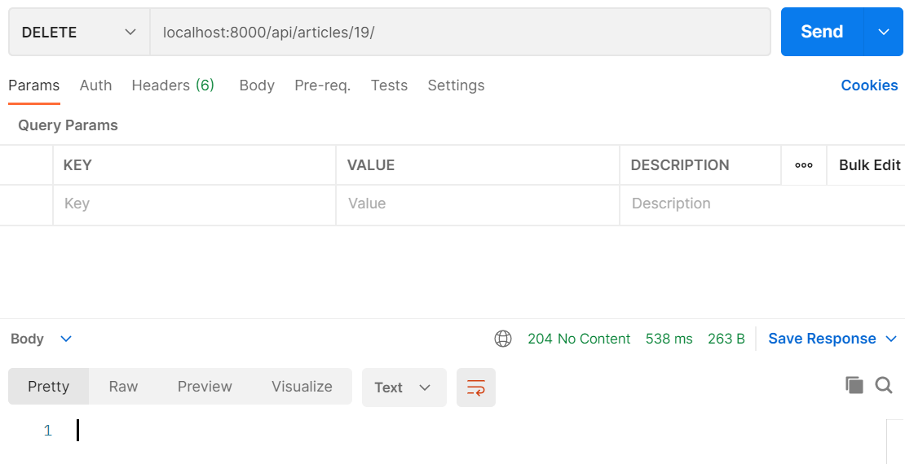


## 8. 코드 실행하기 (with POSTMAN)

- 더미데이터 만들기(django_seed)

  `$ python manage.py seed <appname> --number=15`

  위 코드를 사용하면 해당 앱네임 데이터 베이스에 15개의 더미 데이터를 생성할 수 있다.

  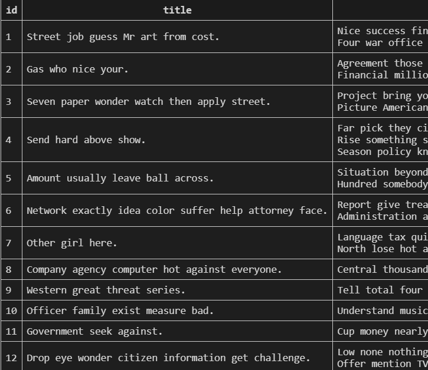


- 위에 사진들처럼 request.method를 설정하고, url을 맞게 입력한 뒤 send를 누르면 밑에 결과창이 나오게 도니다. 단, 유효성 검사를 통과하기 위해서 해당 파일의 형식과 종류는 맞춰주어야한다.


- pretty에서 편하게 결과를 볼 수 있고, preview에서 웹처럼 확인할 수 있다.