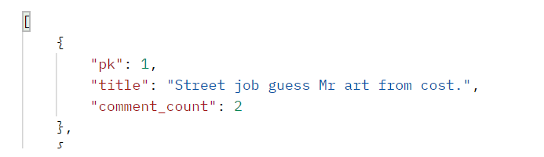
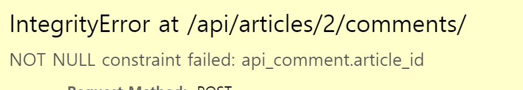
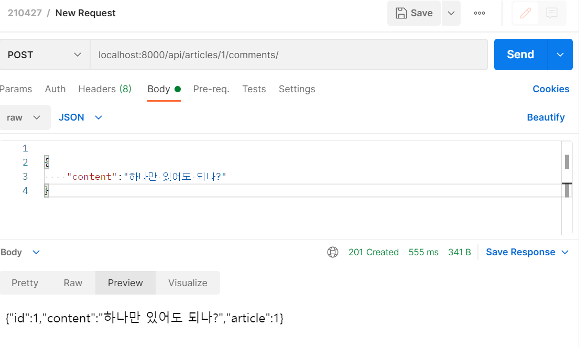
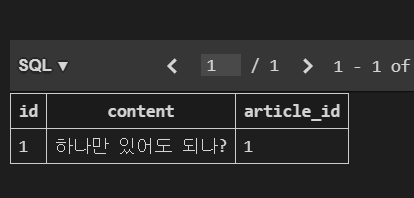
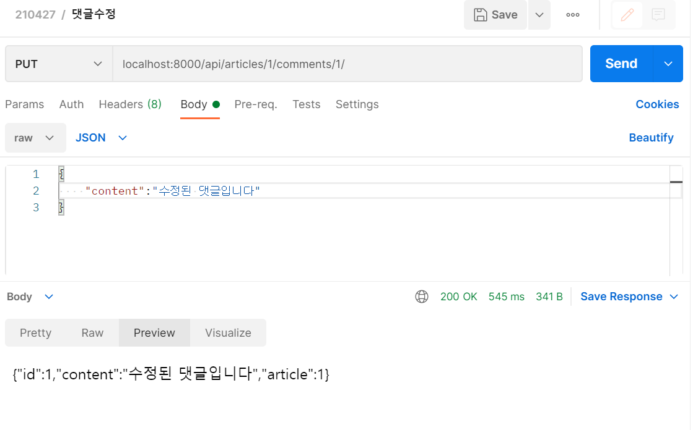
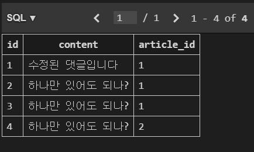
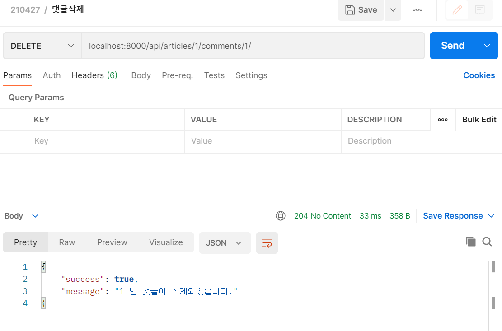
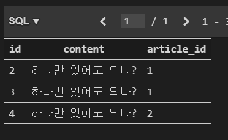

#  Django_Rest_Framework: 댓글작성

- 깨끗한 코드는 항상 교수님 원본을 볼 것

- 2장에 나온 내용 대폭 생략

- 추가내용: 생략가능 -> 혼자서 궁금한 거 적어논 거라 생략하셔도 좋습니다.

- 반복: 생략가능 -> 이전장에서 이미 적은 거지만 중요해보여서 다시 씀

  

## 0. 생략목록

1. 장고의 시작
2. settings.py
3. urls.py -> views.py에 새로 생긴 경로들 추가
4. models.py -> comment 모델 추가


## 1. serializers.py

```python
# 필요한 모델, 양식 불러오기
from rest_framework import serializers
from .models import Article, Comment

# 1. comment
class CommentSerializer(serializers.ModelSerializer):
    content = serializers.CharField(min_length=1, max_length=200)
    class Meta:
        model = Comment 
        fields = '__all__'
        #1.1 read_only 속성을 이용하여 수정과 저장이 불가능하고 조회만 가능하게 한다.
        read_only_fields = ('article',)
        
#2. ArticleSerializer
class ArticleSerializer(serializers.ModelSerializer):
    title = serializers.CharField(min_length=2, max_length=100)
    content = serializers.CharField(min_length=2)
    
    # 2.1.1 Comment 관련한 JSON도 포함해야 함 => CommentSerializer 가 들어 가야한다.
    # 2.1.2 model의 related_name 과 완전히 동일하게 작성
    comments = CommentSerializer(many=True, read_only=True)

    class Meta:
        model = Article
        fields = '__all__'

#3. ArticleListSerializer
class ArticleListSerializer(serializers.ModelSerializer):
    # 3.1 없는 필드(댓글 개수)를 만들어서 JSON을 만들자. 
    #	=> QuerySet API 코드를 string 으로 넘김
    comment_count = serializers.IntegerField(source='comments.count')
    class Meta:
        model = Article
        fields = ('pk', 'title', 'comment_count')
        read_only_fields = fields
```

- serializers는 forms를 대신하여 유효성 검증을 하고 추가로 직렬화를 해준다.

- #1. CommentSerializer

  - read_only_fields

    -  exclude = ('article', ) => validation / JSON 에서 모두 없는 취급이 된다.(즉, crud 모두 불가)

    - read_only 속성을 이용하면, 수정과 저장이 불가능하고 조회는 가능하게 된다.

      

- #2. ArticleSerializer

  - comments = CommentSerializer(many=True, read_only=True)
    - comments를 조회(read)해야하므로 해당 json데이터가 필요하다.
    
    - 그 값을 받기 위해서 #1에서 서술한 CommentSerializer로 json화 해서 받아온다.
    
    - 조회 전용이므로 read_only 속성이 들어간 것 같다(추측)
    
      


- #3. ArticleListSerializer

  - comment_count = serializers.IntegerField(source='comments.count')

    - 현재 필드에는 존재하지 않지만 `댓글의 개수` 라는 정보를 필드로 가지고 싶다.

    - 위 상황을 만족하기 위해서 위 코드를 사용하는데 이 의미는 아래와 같습니다.

       serializers에 IntegerField로 comments.count를 추가합니다.

    - source는 필드를 채우는 데 사용할 속성의 이름을 나타냅니다
    
    - 실제 달린 댓글 수를 봐보자!
    
       


## 2. view.py

### 2-1 . create_comment

```python
@api_view(['POST'])
def create_comment(reqeust, article_pk):
    #1. 댓글을 작성할 아티클정보를 가져온다
    article = get_object_or_404(Article, pk=article_pk)
    #2. 댓글 유효성 검사
    serializer = CommentSerializer(data=reqeust.data)
    #3. 유효성 검사를 실행
    if serializer.is_valid(raise_exception=True):
        #3.1 통과시 serializer의 article에 기록한다.
        serializer.save(article=article)
        return Response(serializer.data, status=status.HTTP_201_CREATED)
```

- #3.1 serializer.save(article=article)

  - 아래 그림과 같이 api_comment.article_id 항이 비게 되므로 article 객체를 넣어줌으로써 해당항을 채워줘야한다.

  

- 댓글을 성공적으로 단 모습

  - 댓글 내용은 article과 content인데 article은 외래키이므로 content만 있으면 된다.

  - postman을 사용한 모습

    

  - db에 들어간 모습

    


### 2-2. update_or_delete_comment

```python
@api_view(['PUT', 'DELETE'])
def update_or_delete_comment(request, article_pk, comment_pk):
    #1. 수정에 필요한 게시글, 댓글 정보 불러오기
    article = get_object_or_404(Article, pk=article_pk)
    comment = get_object_or_404(Comment, pk=comment_pk)
	
    #2 풋 요청의 경우
    if request.method == 'PUT':
        #2.1 현재댓글 정보, 수정하고자 하는 내용을 받아서 입력
        serializer = CommentSerializer(instance=comment, data=request.data)
        #2.2 유효성 검사 진행 후 통과한다면
        if serializer.is_valid(raise_exception=True):
            #2.3 해당 아티클에 저장 후 응답한다
            serializer.save(article=article)
            return Response(serializer.data, status=status.HTTP_200_OK)
	#3 딜리트 요청의 경우
    elif request.method == 'DELETE':
        #3.1 댓글 제거하고
        comment.delete()
        #3.2 제거 성공 메시지 : 사실 기능상 필요없음
        data = {  # cutomize message
            'success': True,
            'message': f'{comment_pk} 번 댓글이 삭제되었습니다.',
        }
        #3.3 길을 잃지 않게 응답이 필요하다. => 상세설명은 2장에 서술
        return Response(data=data, status=status.HTTP_204_NO_CONTENT)
```

- #2 풋요청

  - #2.1 instance= comment : 현재 댓글이 몇번 댓글인지 정보저장
  
  - #2.1 data  = request.data :현재 내용이 응답으로부터 온 수정된 데이터로 변경
  
  - #2.3 위와 마찬가지로 해당 게시글을 찾기 위해서 save시 변수에 넣는다.
  
  - post맨 요청사진
  
    
  
  
  - 실제 db 사진
  
    
  
    
  
- #3 딜리트 요청

  - 해당 기능이 2장과 완벽히 동일하므로 생략
  
  - post맨 사진
  
    
  
  - db사진
  
    