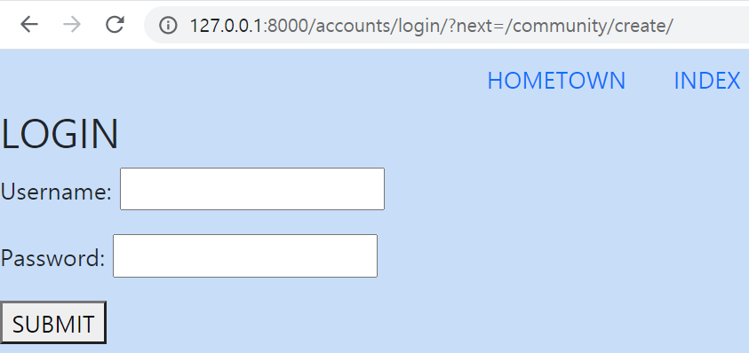

0322  


 # Auth Intro


- login

```python
from django.contrib.auth.forms import AuthenticationForm

def login(request):
    #2 post요청(login)이 들어오면 정보를 AuthenticationForm에 담아서 가져온다.
    if request.method == 'POST':
        form = AuthenticationForm(request, request.POST)
        #3 유효하다면, 로그인한다.
        if form.is_valid():
            #4 로그인을 시켜준다
            auth_login(request, form.get_user())
            #5 next변수에 담긴 url정보를 next_url에 저장해준다.
            next_url = request.GET.get('next')
            #6-1 단축평가에 의해서 next_url이 존재하면 next_url로 이동한다
            #6-2 next_url =''(공백) 이라면, 인덱스로 돌아간다.
            return redirect(next_url or 'articles:index')
    #1 get요청이 온다면,비어있는 AuthenticationForm을 가지고 login.html로 이동한다.
    else:
        form = AuthenticationForm() 
    context = {'form': form, }
    return render(request, 'accounts/login.html', context)
```

1. `AuthenticationForm` : 유저가 존재하는지를 검증하는 Django 내장 모델 폼. 사용자가 로그인 폼에 작성한 정보가 유효한지를 검증함, 빈 폼은 로그인/패스워드 제공
2. next는 변수이다. 만약 로그인이 안 된 상태에서 글작성 등을 들어가면, 로그인 페이지로 이동하면서 url에 그 정보가 입력된 상태로 이동하고 next에 그 정보가 저장된다.( 아래 주소창의 차이를 확인)
3. 그 정보를 request.GET.get을 이용하여 url 자체에서 가져온다!!!
4. 만약 가져올 변수가 없다면 next_url은 공백으로 존재한다.




