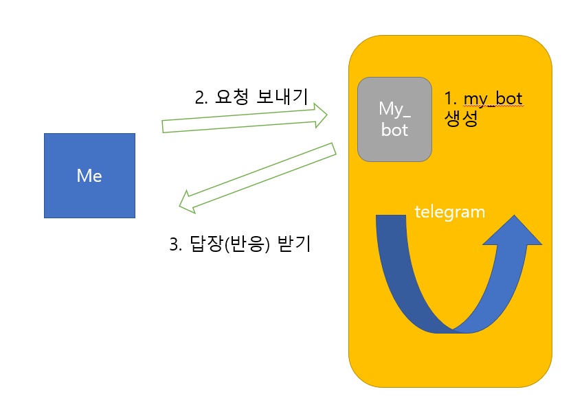

#### Date: 1/15

# start camp 3일차


## 함수

####  - 함수 선언

def 함수명 (input):

​	return 


####  - 함수 사용법

- 함수명() 로 ()가 붙어 있으면 보통 함수

- method로, 동작을 의미하므로 get 등을 이용하여 함수명을 정함

- import를 이용하여 외부의 함수를 현재 함수에서 사용할 수 있다.

  ex) from 함수파일 import 함수명


##  챗봇 모델링

#### - 작동 원리



#### - 핵심 개념

1. 요청 없는 응답은 없다.(선 요청 후 응답)

2. 요청이 있다면, 반드시 응답이 있다(404error 등 인터넷오류 메시지 응답 포함)

3. 요청은 1회성이며, 반드시 url을 통해서만 요청을 보낼 수 있다.

   

#### - 핵심 데이터들

1. my_bot data
2. '나'의 data
3. 보낼 메세지
4. url
   

#### -api 활용법

1. url 주소를 받아온다.

2. 주어진 api key(ex) token)을 입력받아 url 주소에 입력한다.

3. requests.get(url).json() 을 통해서 실행한다.

   `*` api 내 정보접근법은 02문서를 참고한다 

````python
token = 'api key' 
url= f'https://api.telegram.org/bot{token}/getUpdates' 
response = requests.get(url).json() 
````


## 파이썬 코드

- import requests : 응답 함수를 불러온다
- json(): ???


##   기타

- refactoring : 코드를 문법에 맞게 수정, 사용자를 배려하여 설정을 강화 다듬는 작업

- 요청을 하는 사람을 client, 응답을 하는 사람을 server, 두 역활을 모두하는 

  중간과정자들을 웹api서버라 부른다.

- browser는 대표적인 요청 시스템

- api :application programming interface

- url: Uniform Resource Locator 

