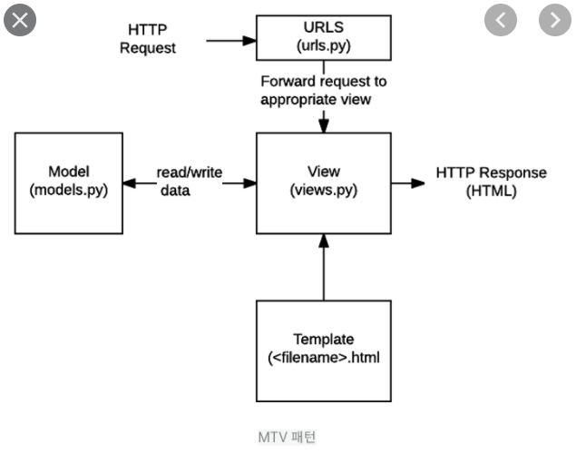
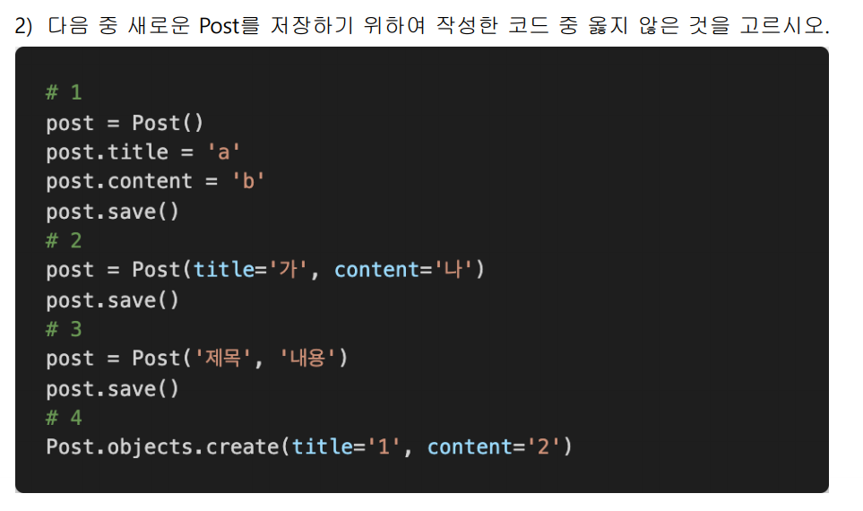
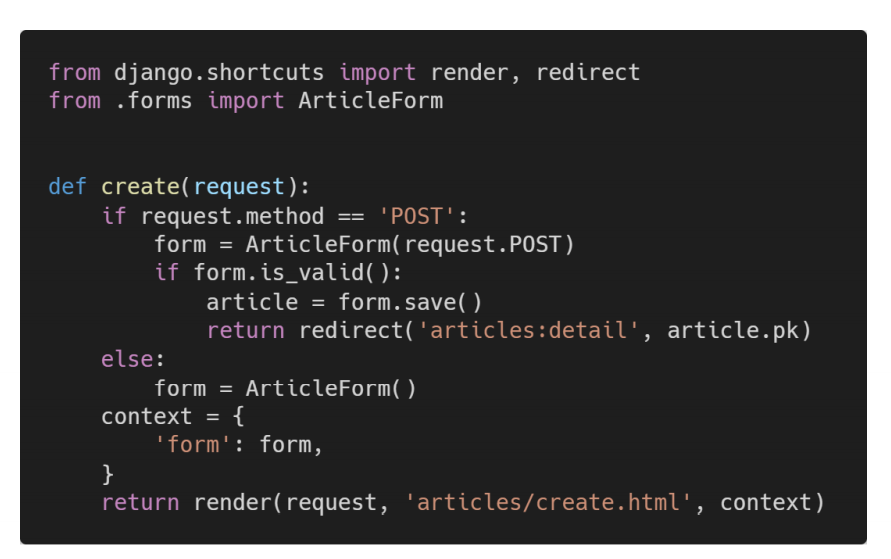

#### Date: 0321

#  Django Problem


1. 소프트웨어 디자인 패턴  mvc의 controller에 해당하는 장고 디자인 패턴을 쓰시오


2. 다음 그림을 보고 서버가 요청을 보냈을 때, 어떤 방식으로 장고가 응답하는 지 100자 이내로 서술하시오

   


3. 다음 중 틀린 것은?
   - DTL은 조건, 반복, 변수 등 다양한 기능을 제공한다.
   - 일부 DTL Tag는 종료태그가 필요 없어도 사용할 수 있다.
   - 일부 DTL 필터는 인자를 추가로 입력받아서 사용할 수 있다.
   - python 문법을 기반으로 python 코드로 실행된다.


 4. DTL필터를 적용하여 소문자로 변수를 표시하고 싶다. {{}}안에 넣을 말을 쓰시오

    (소문자로 바꾸는 필터는 lower이다.)

    ```
    contenxt = {'variable': VariabLE}
    ```

    ```
    {{필터를 적용한 답을 쓰시오}}
    ```


5. 다음 중 틀린 것은?

   - 는 반드시 문서 최상단에 작성되어야한다

   - form의 method는 get과 post 두가지 방식만 존재한다.

   - 을 이용하여 overriden하여서 각html을 수정할 수 있다.

   - form의 action은 데이터를 전송할 url을 의미한다.

     

6. urlpattern에서 name을 만들어주는 것이 어떤 이점이 있는지 서술하시오.(50자 쯤)

   ```python
   urlpatterns = [
       path('', views.index , name= 'index')
   ]
   ```

   

7. django에서 url을 변수처럼 사용하여 동적으로 주소를 만드는 것을 뭐라하는가?


8. 다음 중 옳은 것은?

   - sqlmigrate은 마이그레이션에 대한 sql구문을 볼 때 사용한다.

   - 모델과 데이터베이스는 동일하게 생각할 수 있다.
   - 레코드는 흔히 말하는 표의 열을 의미한다.
   - makemigrations을 사용시 변경 모델을 기반으로 데이터베이스를 수정한다.


9. orm을 사용하는 이유는?


10. 프로젝트가 제대로 migrate가 적용되었는지 알 수 있는 명령어를 쓰시오.


11. 다음 중 틀린 것은?

    - admin 페이지는 django.contrib.auth 모듈에서 제공한다.

    - admin 페이지에서 model에 수정 추가가 가능하다

    - queryset은 데이터베이스로부터 전달받은 객체의 목록으로 반드시 1개이상의 객체를 받아야한다.

    - get을 이용하여 특정 객체를 받을 때 객체가 여러개면 MultipleObjectsReturned에러가 발생한다.

      

12. 

    

13. context와 return 구문이 if문과 같은 레벨로 작성된 이유를 서술하시오.



14. 다음 중 빈칸에 들어갈 말은?

    ```python
    from django.contrib import admin
    from django.urls import path, include
    # 개발중(DEBUG=True) 사용자 업로드 미디어를 서빙하기 위해 아래 코드가 필요합니다.
    from django.conf.urls.static import static
    from django.conf import settings
    
    urlpatterns = [
        path('admin/', admin.site.urls),
        path('uploader/', include('uploader.urls')),
        
    ] + static( (빈칸) , document_root=settings.MEDIA_ROOT)  # DEBUG=False 일 때, []
    ```


15.  다음 중 틀린 것은?

- form은 유효성검사를 할 수 있는 중요한 기능이다.
- ModelForm은 해당 모델에서 양식을 가져와서 사용한다.
- widgets은 반드시 form field에 할당된다.
- widgets은 웹페이지에서 input element의 정밀 가공된  렌더링 처리를 해준다


16. 다음 빈칸에 알맞은 코드를 넣으시오.

    ```python
    from (빈칸) import require_GET, require_POST, require_http_methods
    ```


17. redirect와 render의 차이를 설명하시오.


18. 유효성 검사를 하고자한다. 빈칸에 알맞는 코드를 작성하시오.

    ```python
    @require_http_methods(['GET', 'POST'])
    def new(request):
        if request.method == 'POST':
            form = ArticleForm(request.POST, request.FILES)
            if (빈칸):
                article = form.save()
                return redirect('uploader:detail', article.pk)
    ```


19. 매 저장시 모델에 그 시간을 기록하고자 한다. 빈칸에 알맞는 코드를 작성하시오.

    ```python
    class Article(models.Model):
        title = models.CharField(max_length=100)
        content = models.TextField()
        updated_at = (빈칸)
    ```

    


