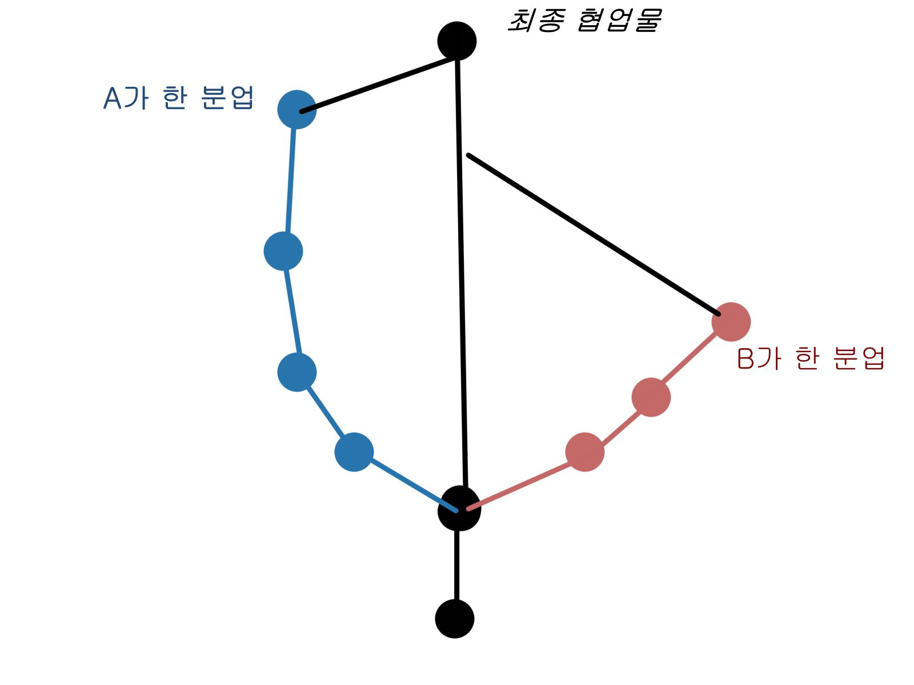

# GIT

##  GIT 명령어 : 업로드

- git init : 컴퓨터의 깃폴더를 생성한다.
- git add .  :변경사항을 스테이징으로 올린다
- git status : 현재상황과 사용가능한 가벼운 명령어를 보여준다.
- git commit -m 'message' : 깃을 커밋한다.(메세지 설정가능)
- git push : git의 저장소(origin)로 커밋을 전달한다.
- git pull : git 저장소의 변경사항을 가져온다.
- git log : git의 최근 로그를 확인한다.

$ reset, restore는 오류발생위험때문에 아직 사용하지 않는다.

## GIT 명령어 : Branch

- git branch : 현재 브런치와 현재 Head(*)를 확인한다
- git branch 000 : 000(브런치이름)를 생성한다
- git branch -d : 브런치를 삭제한다.
- git branch -D : 브런치를 강제삭제한다.
- git switch 000 : 000로 헤드를 전환한다. (구: checkout)
- git switch -c : 000를 생성하고 헤드까지 한번에 전환한다.
- git merge 000 : 000과 병합한다.

	- 단, 헤드가 마스터일때 해야한다.
	- 병합 방법은 마스터가 그대로 브런치를 따라 걷는 방법(fast forword)와 중간지점을 만드는 방법으로 갈린다

## GIT 용어

- Head : 현재 브런치 표기, commit이 생기면 자동으로 그 브런치의 가장 마지막 commit으로 이동한다.

- origin : 저장이 되는 원격 저장소

- master : 중심이 되는 브랜치

  

##  합병하는 이유(협업)

  

## GIT Branch 설명

1. 가장 기본이 되는 브런치를 master라 한다.
2. Head는 현재 브런치를 의미하며, 가장 마지막 commit에 위치한다.
3. 중간에 브런치를 생성하면 Head가 브런치로 넘어간다.
4. 이 브런치를 master와 합병하면 그대로 왔던길을 걸어서 합병시킨다.
5. 만약 브런치의 방향성이 잘못되었다면 브런치를 삭제하고 마스터에서 다시 이어나간다.
6. 만약 master도 브런치도 수정사항이 있다면, 그걸 모두 포함하는 commit을 생성하여 거기서 합병한다.( 대부분의 협업과정)
   - 합병시 충돌이 생기면, 그 충돌에 관해서 수정이 필요하다.

## 기타

1. vscode는 합병 충돌오류가 발생할때, 굉장히 편한  선택지를 제공해준다.

